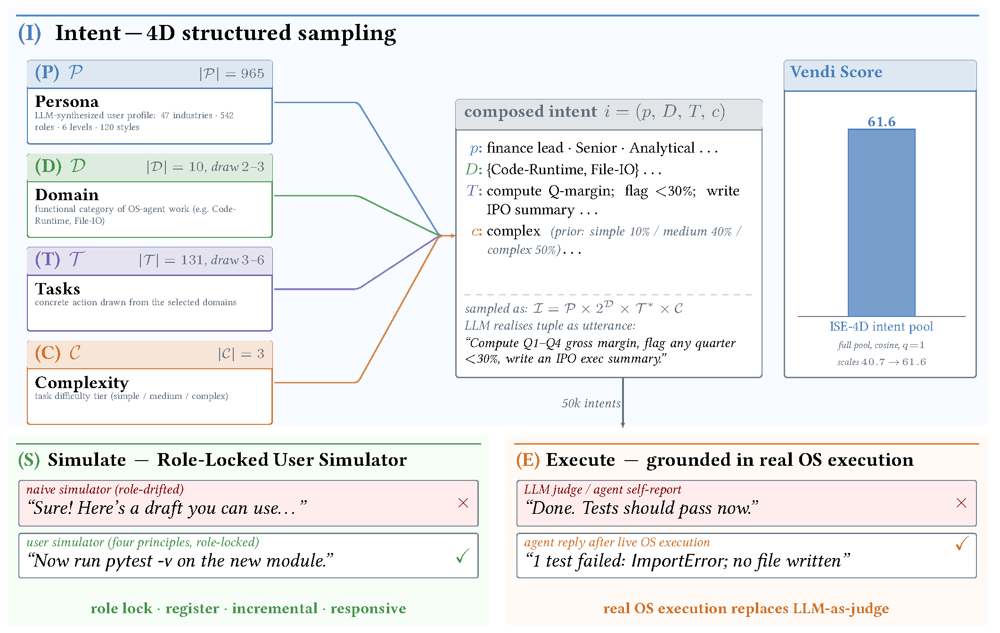
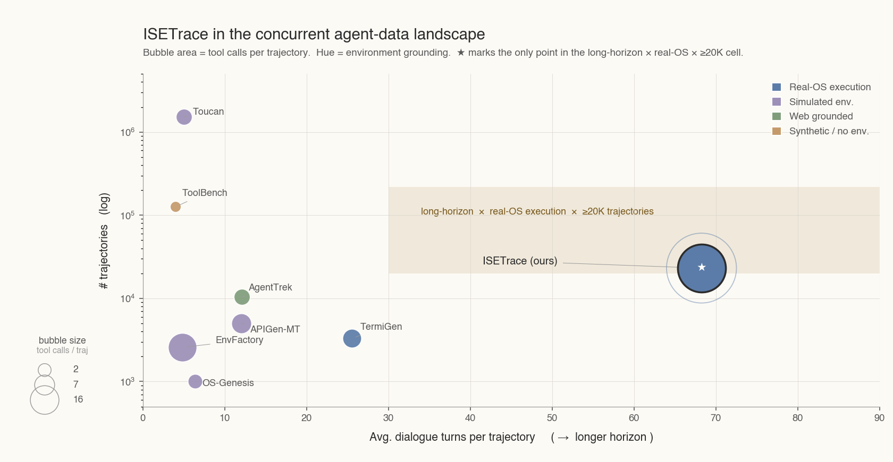
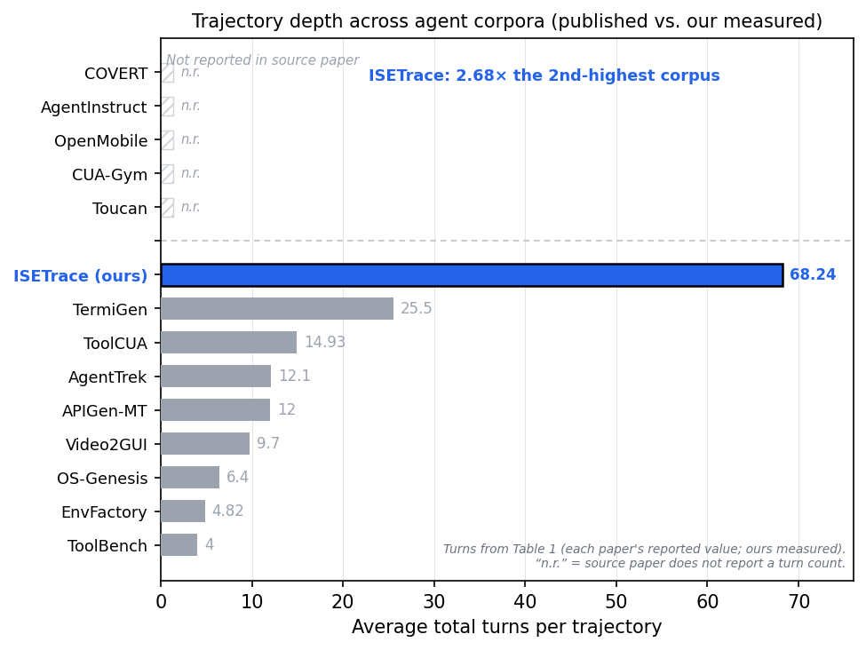
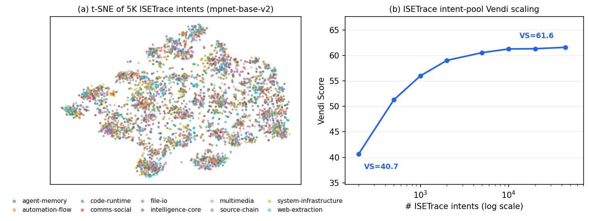

<div align="center">

# ISE-Trace

**An agentic data pipeline, smarter and broader.**

*Intent → Simulate → Execute: a three-stage paradigm that synthesizes diverse, multi-turn, execution-grounded data for training OS agents.*

English · [简体中文](README.md)

[](LICENSE)
[](#)

</div>

> **Paper:** link (coming soon)
>
> **The intent creator:** https://github.com/NairongZheng/intent_creator
>
> **The agent loop gen data pipeline:** https://github.com/NairongZheng/openclaw_gen_data
>
> **The dataset:** huggingface link (coming soon)

---

## What is this

Training a capable OS agent requires data that simultaneously captures **structured user intents**, **multi-turn task delegation**, and **grounded tool execution** — properties largely absent from existing datasets. Most synthesis pipelines start from an API catalog and back-derive tasks (so the task distribution mirrors the tool space rather than what users actually want), are single-turn, and simulate tool calls instead of running them.

**ISE** (**I**ntent → **S**imulate → **E**xecute) is a three-stage synthesis paradigm that addresses these gaps jointly:

| Stage | Name | What it does |
|:-----:|------|--------------|
| **I** | 4D Intent Construction | Samples structured intents over `Persona × Domain × Task × Complexity`, so the training distribution is shaped by user-need composition rather than API availability. |
| **S** | Multi-Turn Simulation | Drives user–agent interaction through a **role-locked user simulator** with four behavioral constraints that suppress *role drift* and *state hallucination*. |
| **E** | Execution Grounding | Runs **every** tool call in a live, isolated OS workspace, yielding authentic failure–recovery dynamics instead of simulated responses. |

The resulting corpus, **ISETrace**, contains **23,132** multi-turn trajectories (avg. **8.12** user turns / **68.24** total dialogue turns, **29.26** tool calls per trajectory) built from **43,956** unique structured intents.

> Fine-tuning Qwen3-8B on ISETrace lifts **ClawEval** pass@1 from **19.3 → 37.7** (+18.4 pts, 1.95×), surpassing both a GPT-4o zero-shot reference and a 4×-larger Qwen3-32B base.

<div align="center">
  
  <br>
  <em>The ISE paradigm at a glance. Each stage contrasts a typical failure mode of prior work (top, ✗) with what ISE contributes (bottom, ✓).</em>
</div>

---

## The Pipeline

ISE-Trace is the umbrella project. The pipeline is split across two repositories, one per phase:

```
                 ┌─────────────────────────┐         ┌──────────────────────────────────┐
   4D sampling   │     intent_creator      │ intents │        openclaw_gen_data         │  trajectories
  ─────────────► │  Stage 1: 4D Intent     │ ──────► │  Stage 2+3: Multi-Turn Simulation│ ─────────────►  ISETrace
                 │       Construction      │ .jsonl  │       + Execution Grounding      │   middle format
                 └─────────────────────────┘         └──────────────────────────────────┘
```

| Repository | Role | Link |
|------------|------|------|
| **`intent_creator`** | **Stage 1.** Domain-based 4D intent generation. Samples `Persona × Domain × Task × Complexity` and renders each structured tuple into a natural-language user intent via an LLM. | [github.com/NairongZheng/intent_creator](https://github.com/NairongZheng/intent_creator) |
| **`openclaw_gen_data`** | **Stage 2 + 3.** Drives a local [OpenClaw](https://github.com/openclaw/openclaw) agent through multi-turn, role-locked user simulation; executes every tool call against a real OS in an isolated worker workspace; archives full sessions and converts them to training-ready *middle format*. | [github.com/NairongZheng/openclaw_gen_data](https://github.com/NairongZheng/openclaw_gen_data) |

---

## Key Features

- **Intent-first, not tool-first.** A `Persona × Domain × Task × Complexity` sampling space exceeding 10¹¹ combinations — long-tail and cross-domain intents are sampled rather than back-derived from an API list.
- **Role-locked multi-turn simulation.** Four behavioral principles — *perspective lock*, *register matching*, *incremental advancement*, *responsive conditioning* — keep the user simulator from drifting into assistant-style language or hallucinating execution state. Measured role-drift rate in the released corpus: **0.02%**.
- **Real execution, real failures.** Every `exec` invokes an actual shell with real stdout/stderr/exit codes; file ops touch a real filesystem. Trajectories carry authentic credential failures, non-zero exits, and recovery — not model self-reports.
- **Workspace isolation at scale.** Each worker runs in an isolated workspace restored from a shared snapshot template, reducing storage from O(N) to O(1) per worker. Supports concurrency and resume.
- **Quantified diversity.** Full-stack diversity reported alongside the corpus — embedding (Vendi), lexical (Distinct-N), and structural (tool-call topology).

---

<div align="center">
  
  <br>
  <em>ISETrace in the concurrent agent-data landscape. x-axis = avg. dialogue turns per trajectory; y-axis = #trajectories (log). Bubble area = tool calls per trajectory; hue = environment grounding.</em>
</div>

## ISETrace at a Glance

| Statistic | Value |
|-----------|------:|
| Structured intents (unique) | 43,956 |
| Complete trajectories | 23,132 |
| Avg. user turns / trajectory | 8.12 (med. 8, max 23) |
| Trajectories with 6–10 user turns | 91.1% |
| Avg. total dialogue turns | 68.24 (max 565) |
| Avg. tool calls / trajectory | 29.26 |
| Avg. unique tools / trajectory | 4.69 |
| Domains × Tasks × Tools (avg.) | 2.35 × 4.40 × 3.18 |
| Complexity (complex / medium / simple) | 50% / 40% / 10% |
| Full-pool Vendi Score (mpnet-base-v2, cosine, q=1) | 61.57 |

Trajectories span **10 functional domains** (Intelligence-Core, Code-Runtime, File-IO, Source-Chain, Automation-Flow, Web-Extraction, Comms-Social, Multimedia, Agent-Memory, System-Infrastructure) and **965** distinct personas across 47 industries.

---

## Quick Start

The two stages run independently — Stage 1 produces an `intents.jsonl`, which Stage 2+3 consumes. Each repository has its own detailed README; the flow below shows how they connect.

### Stage 1 — Generate intents (`intent_creator`)

```bash
git clone https://github.com/NairongZheng/intent_creator
cd intent_creator
pip install -r requirements.txt

# Configure your LLM endpoint
cp .env.example .env          # set OPENAI_API_KEY and OPENAI_BASE_URL

# Generate intents (async, recommended)
python main.py --count 1000 --async --max-concurrent 50 --output intents_out
```

This writes structured intents to `intents_out/intents.jsonl`, each line carrying a `natural_language_intent` plus its sampled domain / task / persona / complexity.

### Stage 2 + 3 — Generate & ground trajectories (`openclaw_gen_data`)

```bash
git clone https://github.com/NairongZheng/openclaw_gen_data
cd openclaw_gen_data
pip install -r requirements.txt
cp config/config.yaml.example config/config.yaml

# Initialize agent workers (captures the real runtime tools + system prompt)
python scripts/init_agents.py --num-agents 4 --force-recreate --refresh-tools

# Drive multi-turn simulation + live execution over the intents from Stage 1
INTENTS_FILE=../intent_creator/intents_out/intents.jsonl \
python scripts/run_generation.py --concurrent 4
```

Output:
- raw sessions → `output/sessions/`
- training-ready middle format → `output/middle_format/`

> **Prerequisite:** Stage 2+3 requires a working local [OpenClaw](https://github.com/openclaw/openclaw) installation (or its Docker setup) as the execution substrate. See the `openclaw_gen_data` README for container deployment and search-provider configuration. The paradigm is agent-system-agnostic — any platform supporting live tool execution and workspace isolation can serve as the substrate.

---

## Results

Fine-tuning on ISETrace, evaluated on **ClawEval** (pass@1, %, on the common set of 114 *T*-family agent tool-use tasks scored under every run):

| System | pass@1 | Completion | Robustness |
|--------|:------:|:----------:|:----------:|
| Qwen3-8B (base, 0-shot) | 19.3 | 0.367 | 0.925 |
| Qwen3-32B (base, 0-shot) | 30.7 | 0.446 | 0.947 |
| GPT-4o (0-shot) | 25.4 | 0.442 | 0.965 |
| **SFT-ISETrace (8B, ours)** | **37.7** | **0.533** | 0.959 |

The fine-tuned 8B model surpasses the GPT-4o reference (+12.3 pts) and the 4×-larger Qwen3-32B base (+7.0 pts). The gain comes primarily from task completion while robustness on perturbed tool outputs holds high. An ablation truncating trajectories to a single user turn drops pass@1 to 28.1 (−9.6 pts), indicating multi-turn simulation contributes a substantial share of the gain.

---

<div align="center">
  
  <br>
  <em>Trajectory depth across fourteen agent corpora (avg. total turns). ISETrace leads by a wide margin at 68.24 turns, 2.68× the next corpus.</em>
</div>

<div align="center">
  
  <br>
  <em>Coverage analysis. Left: t-SNE of 5,000 intents — all 10 domains overlap rather than cluster. Right: Vendi grows from 40.7 to 61.6 (full pool), close to but not saturated.</em>
</div>

## Repository Structure

```
ISE-Trace/                    ← this repo (umbrella / entry point)
├── README.md                 #  简体中文
├── README_en.md              #  English (this file)
└── LICENSE

intent_creator/               ← Stage 1  (separate repo)
├── main.py                   #  entry point
├── domains/                  #  10 functional domain definitions
├── libraries/                #  global persona / tool / skill pools
├── src/{builders,generators,libraries,models,validators}/
└── config.yaml

openclaw_gen_data/            ← Stage 2 + 3  (separate repo)
├── scripts/run_generation.py #  main entry point
├── scripts/init_agents.py    #  worker init + runtime probe
├── src/                      #  agent runtime, session parser, converter, ...
├── data_examples/            #  sample intents, session, middle format
└── docs/                     #  architecture, run-modes, deployment
```

---

## Citation

If you use ISE-Trace, the ISE paradigm, or the ISETrace dataset, please cite:

```bibtex
@misc{isetrace2026,
  title        = {From Intent to Trajectory: Execution-Grounded Multi-Turn Data Synthesis for OS Agents},
  author       = {Valiere01},
  year         = {2026},
  howpublished = {\url{https://github.com/Valiere01/ISE-Trace}},
  note         = {Paper link forthcoming}
}
```

---

## License

Code in this project is released under the [MIT License](LICENSE). The ISETrace dataset is distributed separately; see the dataset card for its terms.
